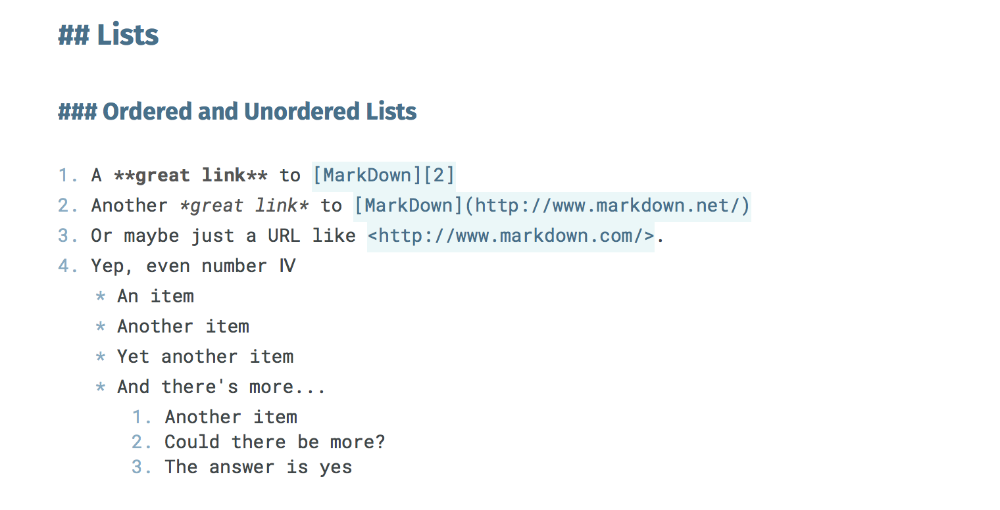

Snowball
========

A light, clean Markdown text editor theme for the [Mou](http://mouapp.com/) and [LightPaper](http://lightpaper.42squares.in/) Markdown editors.

## Example





## Install

### Install Theme Fonts

Install the [Fira Sans](fonts/FiraSans), [Hack](fonts/Hack), and [Roboto Mono](fonts/RobotoMono) fonts that are included in the Snowball repository `fonts` directory.

### Install Theme File

#### Automated Theme File Installation
Use the install.sh script in the Mou or LightPaper directory.  This will automatically install the theme for you. Clone this repository, navigate to the directory for your Markdown editor and enter the following:
```
chmod 744 install.sh
./install.sh
```
#### Manual Theme File Installation

Place the `Snowball.txt` file in your application's Themes directory.

**Mou Themes** : `~/Library/Application Support/Mou/Themes` [Docs](http://mouapp.com/)

**LightPaper Themes** : `~/.lightpaper/Themes` [Docs](https://github.com/42Squares/LightPaper/blob/master/Adding%20Custom%20Themes.md)

### Set Theme in Your Editor
Open your Markdown editor, open the Preferences pane, & select the Snowball theme in the dropdown for the text editor themes (not the preview themes!).

### Set Base Font

Set your base font to Roboto Mono - 14 in your Preferences pane.

